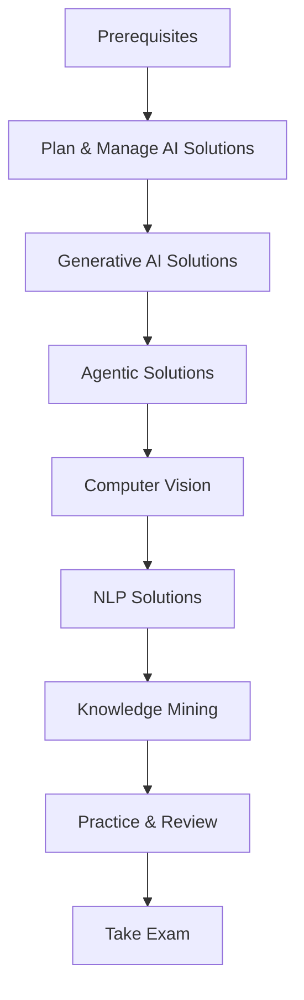

# 🤖 AI-102: Azure AI Engineer Associate

## 📋 Overview

The **Azure AI Engineer Associate** certification validates your ability to build, manage, and deploy AI solutions using Azure AI services. This is a role-based certification for professionals who design and implement AI solutions.

### 🎯 Who Should Take This Exam?

This certification is ideal for:
- AI Engineers building Azure AI solutions
- Software developers integrating AI into applications
- Data engineers working with AI workloads
- Solution architects designing AI solutions
- DevOps engineers deploying AI models

### ✅ Prerequisites

**Recommended Knowledge:**
- Python or C# programming experience
- REST APIs and SDK usage
- Azure fundamentals (AZ-900 recommended)
- AI-900 for foundational concepts
- Understanding of Responsible AI principles

**Technical Skills:**
- Experience with Azure AI services
- Knowledge of data storage options
- Familiarity with CI/CD pipelines

## 📊 Skills Measured (As of April 30, 2025)

| Domain | Weight |
|--------|--------|
| Plan and manage an Azure AI solution | 20-25% |
| Implement generative AI solutions | 15-20% |
| Implement an agentic solution | 5-10% |
| Implement computer vision solutions | 10-15% |
| Implement NLP solutions | 15-20% |
| Implement knowledge mining and information extraction | 15-20% |

## 📚 Quick Links

| Resource | Description |
|----------|-------------|
| [📖 Study Guide](./study-guide.md) | Detailed exam objectives and study topics |
| [📚 Learning Modules](./learning-modules.md) | Official Microsoft Learn paths and modules |
| [🧪 Practice Resources](./practice-resources.md) | Practice tests, labs, and exercises |
| [🔬 Hands-On Labs](./hands-on-labs.md) | Comprehensive lab exercises |
| [📁 Labs](./labs/) | Lab files and code samples |
| [🔧 Azure Resources Reference](./azure-resources.md) | Deep dive on all Azure AI services used in AI-102 |

## 🎯 Exam Details

| Aspect | Details |
|--------|---------|
| **Exam Code** | AI-102 |
| **Exam Title** | Designing and Implementing a Microsoft Azure AI Solution |
| **Duration** | 120 minutes |
| **Questions** | 40-60 questions |
| **Passing Score** | 700/1000 |
| **Cost** | $165 USD |
| **Languages** | English, Japanese, Chinese (Simplified), Korean, German, French, Spanish, Portuguese (Brazil), Chinese (Traditional), Italian |

## 🛤️ Learning Path

## 🆕 Recent Exam Updates (April 2025)

Major changes to the AI-102 exam include:

| Change | Description |
|--------|-------------|
| **New: Agentic Solutions** | 5-10% of exam now covers AI agents |
| **Azure AI Foundry** | Updated to use Azure AI Foundry services |
| **MCP Integration** | Model Context Protocol topics added |
| **Content Understanding** | New Azure AI Content Understanding section |
| **Generative AI Focus** | Increased emphasis on GenAI solutions |

## 📅 Suggested Study Schedule (8 Weeks)

### Weeks 1-2: Foundation & Planning
- [ ] Azure AI solution planning
- [ ] Responsible AI implementation
- [ ] Azure AI Foundry services
- [ ] Model selection and deployment

### Weeks 3-4: Generative AI & Agents
- [ ] Azure OpenAI integration
- [ ] RAG implementation
- [ ] Prompt engineering
- [ ] Building custom agents
- [ ] Multi-agent orchestration

### Weeks 5-6: Vision & NLP
- [ ] Computer vision solutions
- [ ] Custom vision models
- [ ] Text analytics
- [ ] Speech services
- [ ] Custom language models

### Weeks 7-8: Knowledge Mining & Review
- [ ] Azure AI Search implementation
- [ ] Document Intelligence
- [ ] AI Content Understanding
- [ ] Practice assessments
- [ ] Final review

## 🔗 Official Resources

- [Official Exam Page](https://learn.microsoft.com/en-us/credentials/certifications/azure-ai-engineer/)
- [Study Guide](https://learn.microsoft.com/en-us/credentials/certifications/resources/study-guides/ai-102)
- [Free Practice Assessment](https://learn.microsoft.com/en-us/credentials/certifications/exams/ai-102/practice/assessment?assessment-type=practice&assessmentId=61)
- [Exam Sandbox](https://aka.ms/examdemo)
- [AI-102 Course (AI-102T00)](https://learn.microsoft.com/en-us/training/courses/ai-102t00)

## 📖 Documentation Links

| Service | Documentation |
|---------|---------------|
| Azure AI Services | [Link](https://learn.microsoft.com/en-us/azure/ai-services/) |
| Azure AI Vision | [Link](https://learn.microsoft.com/en-us/azure/cognitive-services/computer-vision/) |
| Azure AI Language | [Link](https://learn.microsoft.com/en-us/azure/cognitive-services/luis/) |
| Azure AI Speech | [Link](https://learn.microsoft.com/en-us/azure/ai-services/speech-service/) |
| Azure AI Search | [Link](https://learn.microsoft.com/en-us/azure/search/) |
| Azure OpenAI | [Link](https://learn.microsoft.com/en-us/azure/ai-services/openai/) |
| Azure AI Document Intelligence | [Link](https://learn.microsoft.com/en-us/azure/ai-services/document-intelligence/) |
| Azure AI Foundry | [Link](https://learn.microsoft.com/en-us/azure/ai-foundry/) |

## 🎓 Related Certifications

After earning AI-102, consider:
- **AB-100**: Agentic AI Business Solutions Architect
- **DP-100**: Azure Data Scientist Associate
- **AZ-305**: Azure Solutions Architect Expert

---

*Last updated: November 2025*
