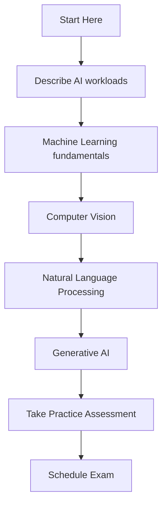

# 🤖 AI-900: Microsoft Azure AI Fundamentals

## 📋 Overview

The **Azure AI Fundamentals** certification validates foundational knowledge of machine learning (ML) and artificial intelligence (AI) concepts, and related Microsoft Azure services.

### 🎯 Who Should Take This Exam?

This certification is ideal for:
- IT professionals seeking to understand AI concepts
- Business stakeholders exploring AI solutions
- Developers new to AI/ML
- Students starting their Azure AI journey
- Anyone interested in AI without deep technical background

### ✅ Prerequisites

- Basic cloud concepts understanding
- Familiarity with client-server applications
- No programming experience required
- No data science background needed

## 📊 Skills Measured (As of May 2025)

| Domain | Weight |
|--------|--------|
| Describe AI workloads and considerations | 15-20% |
| Describe fundamental principles of machine learning on Azure | 15-20% |
| Describe features of computer vision workloads on Azure | 15-20% |
| Describe features of NLP workloads on Azure | 15-20% |
| Describe features of generative AI workloads on Azure | 20-25% |

## 📚 Quick Links

| Resource | Description |
|----------|-------------|
| [📖 Study Guide](./study-guide.md) | Detailed exam objectives and study topics |
| [📚 Learning Modules](./learning-modules.md) | Official Microsoft Learn paths and modules |
| [🧪 Practice Resources](./practice-resources.md) | Practice tests, labs, and exercises |
| [🔬 Labs](./labs/) | Hands-on lab exercises |
| [🔧 Azure Resources Reference](./azure-resources.md) | Explanation of all Azure AI services used in AI-900 |

## 🎯 Exam Details

| Aspect | Details |
|--------|---------|
| **Exam Code** | AI-900 |
| **Exam Title** | Microsoft Azure AI Fundamentals |
| **Duration** | 45 minutes |
| **Questions** | 40-60 questions |
| **Passing Score** | 700/1000 |
| **Cost** | $99 USD |
| **Language** | Multiple languages available |

## 🛤️ Learning Path

## 📅 Suggested Study Schedule (4 Weeks)

### Week 1: AI Fundamentals & ML Basics
- [ ] Introduction to AI concepts
- [ ] Understanding AI workloads
- [ ] Responsible AI principles
- [ ] Basic machine learning concepts

### Week 2: Machine Learning on Azure
- [ ] Regression and classification
- [ ] Clustering techniques
- [ ] Azure Machine Learning capabilities
- [ ] Automated ML

### Week 3: Computer Vision & NLP
- [ ] Image analysis and classification
- [ ] Object detection
- [ ] Text analytics
- [ ] Language understanding

### Week 4: Generative AI & Review
- [ ] Azure OpenAI Service
- [ ] Generative AI concepts
- [ ] Practice assessments
- [ ] Final review

## 🔗 Official Resources

- [Official Exam Page](https://learn.microsoft.com/en-us/credentials/certifications/azure-ai-fundamentals/)
- [Study Guide](https://learn.microsoft.com/en-us/credentials/certifications/resources/study-guides/ai-900)
- [Free Practice Assessment](https://learn.microsoft.com/en-us/credentials/certifications/exams/ai-900/practice/assessment?assessment-type=practice&assessmentId=26)
- [Exam Sandbox](https://aka.ms/examdemo)

## 🎓 Next Steps After Certification

After earning AI-900, consider:
- **AI-102**: Azure AI Engineer Associate
- **DP-100**: Azure Data Scientist Associate
- **AZ-900**: Azure Fundamentals (for broader Azure knowledge)

---

*Last updated: November 2025*
