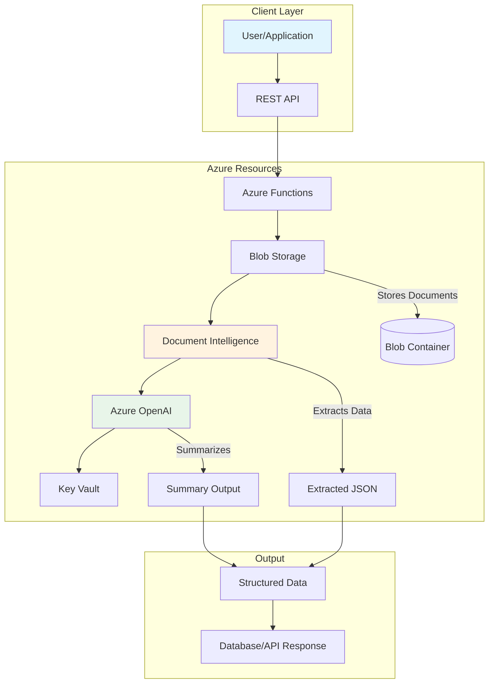

# Project 01: Intelligent Document Processing


## 🎯 Project Overview

Build an intelligent document processing system that automatically extracts, analyzes, and summarizes information from various document types (PDFs, images, invoices, receipts) using Azure AI services.

### What You'll Build

- Document upload and storage pipeline
- Automated text extraction using Azure Document Intelligence
- AI-powered summarization using Azure OpenAI
- Structured data extraction for invoices and forms
- REST API for document processing

### Skills You'll Learn

- Azure Document Intelligence (Form Recognizer)
- Azure OpenAI integration
- Azure Blob Storage configuration
- Python SDK usage for Azure services
- Infrastructure as Code with Terraform

---

## 📦 Azure Resources Required

| Resource | SKU/Tier | Purpose |
|----------|----------|---------|
| Azure Document Intelligence | S0 | Document analysis and extraction |
| Azure OpenAI | S0 | Text summarization and insights |
| Azure Blob Storage | Standard LRS | Document storage |
| Azure Key Vault | Standard | Secrets management |
| Azure Functions | Consumption | API endpoints (optional) |

### Estimated Monthly Cost

- **Development/Testing**: $20-50/month
- **Production (low volume)**: $50-100/month

---

## 🏗️ Architecture



---

## 📁 Project Structure

```
project-01-document-processing/
├── README.md                 # This file
├── setup.md                  # Detailed setup instructions
├── architecture.md           # Architecture deep dive
├── checklist.md             # Step-by-step implementation
├── src/
│   ├── __init__.py
│   ├── config.py            # Configuration management
│   ├── document_processor.py # Main processing logic
│   ├── blob_handler.py      # Blob storage operations
│   ├── openai_client.py     # OpenAI integration
│   └── main.py              # Application entry point
└── terraform/
    ├── main.tf              # Main Terraform configuration
    ├── variables.tf         # Variable definitions
    ├── outputs.tf           # Output values
    └── terraform.tfvars.example # Example variables
```

---

## 🚀 Quick Start

### 1. Deploy Infrastructure

```bash
cd terraform
cp terraform.tfvars.example terraform.tfvars
# Edit terraform.tfvars with your values
terraform init
terraform plan
terraform apply
```

### 2. Configure Environment

```bash
cd ../src
cp .env.example .env
# Edit .env with values from Terraform outputs
```

### 3. Run the Application

```bash
pip install -r requirements.txt
python main.py
```

---

## 📖 Detailed Instructions

See the following files for detailed instructions:

1. [Setup Guide](./setup.md) - Environment and subscription setup
2. [Architecture Guide](./architecture.md) - Detailed architecture explanation
3. [Implementation Checklist](./checklist.md) - Step-by-step guide

---

## ✅ Learning Outcomes

After completing this project, you will be able to:

- [ ] Provision Azure Document Intelligence resources
- [ ] Configure Azure OpenAI for text processing
- [ ] Build document processing pipelines
- [ ] Extract structured data from unstructured documents
- [ ] Implement Infrastructure as Code with Terraform
- [ ] Manage secrets securely with Key Vault

---

## 🔗 Related Resources

- [Azure Document Intelligence Documentation](https://learn.microsoft.com/en-us/azure/ai-services/document-intelligence/)
- [Azure OpenAI Documentation](https://learn.microsoft.com/en-us/azure/ai-services/openai/)
- [Terraform AzureRM Provider](https://registry.terraform.io/providers/hashicorp/azurerm/latest/docs)

---

*Last updated: November 2025*
