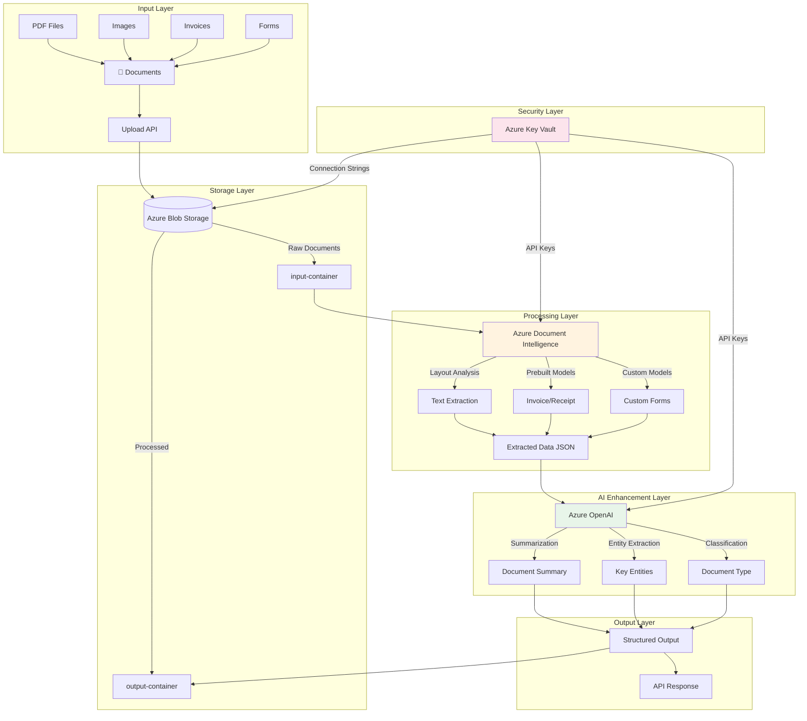
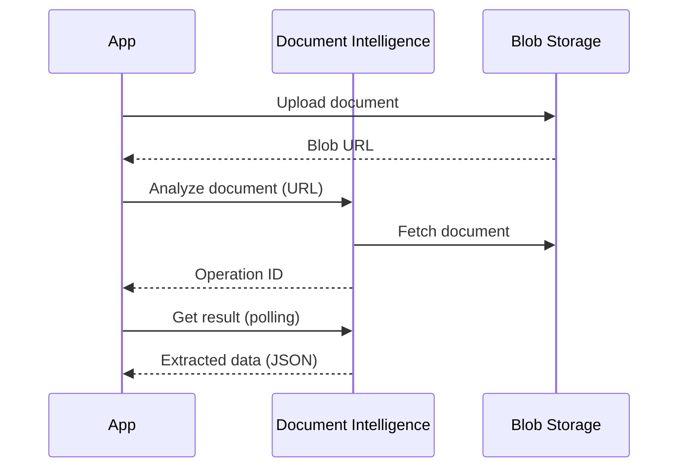
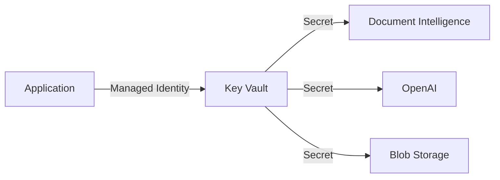
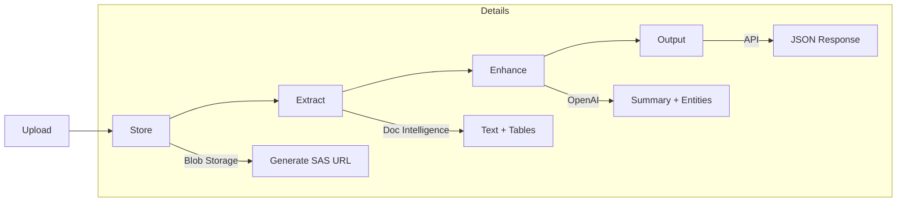
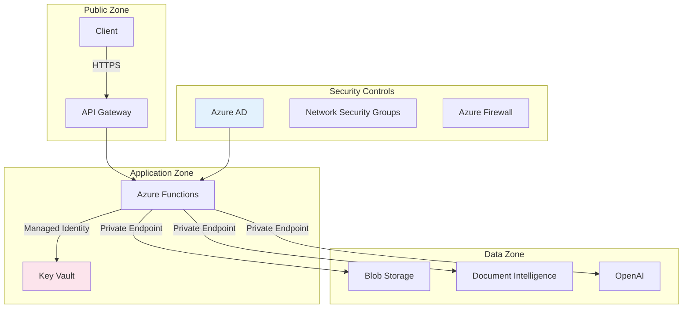
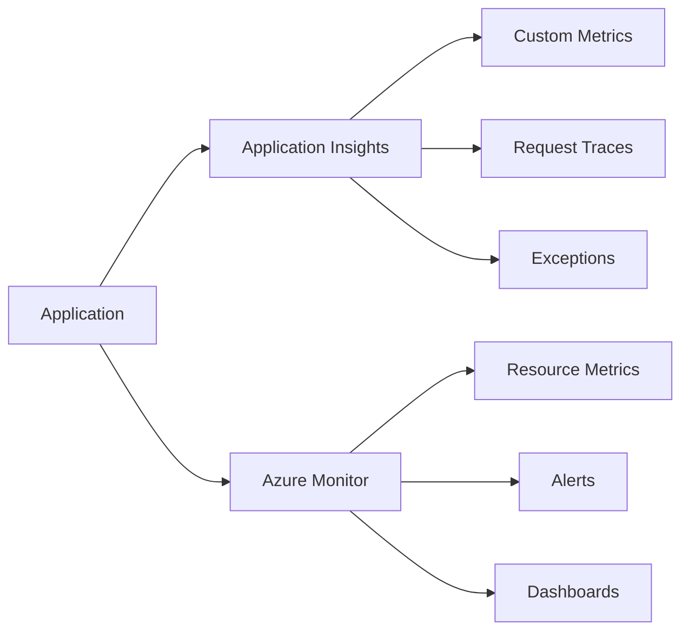

# Project 01: Architecture Guide

## 🏗️ System Architecture

This document provides a detailed explanation of the Intelligent Document Processing architecture.

---

## High-Level Architecture



---

## Component Details

### 1. Azure Blob Storage

**Purpose**: Store input documents and processed outputs

| Container | Purpose | Access Level |
|-----------|---------|--------------|
| `input-documents` | Raw uploaded documents | Private |
| `processed-documents` | Extracted data and summaries | Private |
| `archive` | Long-term storage | Private (Cool tier) |

**Configuration**:
```hcl
# Lifecycle management
lifecycle_rule {
  action { type = "Delete" }
  condition { age = 90 }
}
```

---

### 2. Azure Document Intelligence

**Purpose**: Extract text, tables, and structured data from documents

**Models Used**:

| Model | Use Case | Features |
|-------|----------|----------|
| `prebuilt-layout` | General documents | Text, tables, structure |
| `prebuilt-invoice` | Invoice processing | Vendor, amounts, line items |
| `prebuilt-receipt` | Receipt processing | Merchant, total, items |
| `prebuilt-document` | General extraction | Key-value pairs, entities |

**API Flow**:


---

### 3. Azure OpenAI

**Purpose**: Enhance extracted data with AI capabilities

**Deployment Configuration**:

| Model | Deployment Name | Use Case |
|-------|-----------------|----------|
| GPT-4o | `gpt-4o-docproc` | Summarization, analysis |
| text-embedding-3-large | `embedding-docproc` | Vector search (optional) |

**Prompt Engineering**:

```python
SYSTEM_PROMPT = """
You are a document analysis assistant. Given extracted document text,
provide:
1. A concise summary (2-3 sentences)
2. Key entities (people, organizations, dates, amounts)
3. Document classification (invoice, contract, report, etc.)

Respond in JSON format.
"""
```

---

### 4. Azure Key Vault

**Purpose**: Secure storage for secrets and API keys

**Secrets Stored**:

| Secret Name | Purpose |
|-------------|---------|
| `document-intelligence-key` | Document Intelligence API key |
| `openai-api-key` | OpenAI API key |
| `storage-connection-string` | Blob Storage connection |

**Access Pattern**:


---

## Data Flow

### Document Processing Pipeline



### Processing Steps

1. **Upload**: Client uploads document via REST API
2. **Store**: Document saved to Blob Storage with metadata
3. **Extract**: Document Intelligence analyzes the document
4. **Enhance**: OpenAI provides summaries and insights
5. **Output**: Structured JSON returned to client

---

## Security Architecture



---

## Scalability Considerations

### Horizontal Scaling

| Component | Scaling Strategy |
|-----------|-----------------|
| Blob Storage | Auto-scaling (no limit) |
| Document Intelligence | Concurrent requests (S0: 15 TPS) |
| OpenAI | TPM/RPM limits per deployment |
| Functions | Consumption plan auto-scale |

### Rate Limiting

```python
# Rate limiting configuration
RATE_LIMITS = {
    "document_intelligence": 15,  # Transactions per second
    "openai_gpt4": 10000,         # Tokens per minute
    "openai_requests": 100,       # Requests per minute
}
```

---

## Monitoring and Observability



### Key Metrics

| Metric | Description | Alert Threshold |
|--------|-------------|-----------------|
| Processing Time | End-to-end latency | > 30 seconds |
| Error Rate | Failed requests | > 5% |
| Queue Depth | Pending documents | > 100 |
| API Usage | OpenAI token consumption | > 80% quota |

---

## Cost Optimization

### Resource Tiers

| Environment | Document Intelligence | OpenAI | Storage |
|-------------|----------------------|--------|---------|
| Development | F0 (Free) | PTU Dev | LRS |
| Staging | S0 | Standard | LRS |
| Production | S0 | PTU | GRS |

### Cost Reduction Strategies

1. **Use F0 tier** for development and testing
2. **Implement caching** for repeated document analysis
3. **Batch processing** to optimize API calls
4. **Lifecycle policies** for storage cleanup

---

*Next: [Implementation Checklist](./checklist.md)*
