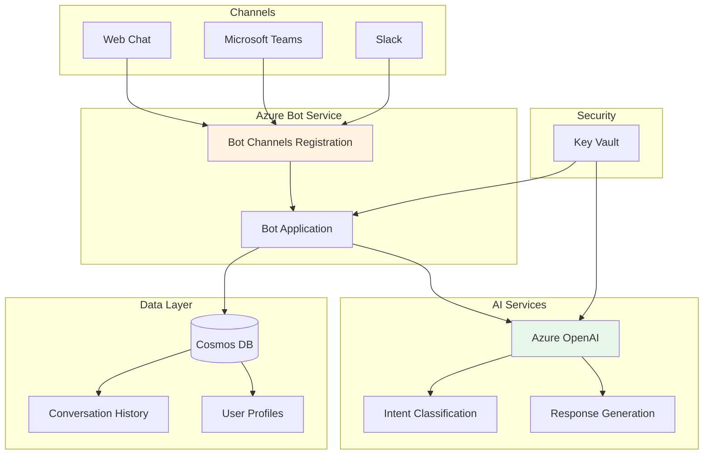

# Project 02: AI-Powered Customer Service Bot


## 🎯 Project Overview

Build an intelligent customer service chatbot that uses Azure OpenAI for natural language understanding and Azure Bot Service for multi-channel deployment.

### What You'll Build

- Conversational AI bot with context awareness
- Integration with Azure OpenAI for intelligent responses
- Multi-channel deployment (Web, Teams, Slack)
- Intent recognition and entity extraction
- Conversation history and analytics

### Skills You'll Learn

- Azure Bot Service configuration
- Azure OpenAI chat completions
- Conversational AI design patterns
- Bot Framework SDK
- Multi-channel deployment

---

## 📦 Azure Resources Required

| Resource | SKU/Tier | Purpose |
|----------|----------|---------|
| Azure Bot Service | S1 | Bot hosting and channel management |
| Azure OpenAI | S0 | Natural language processing |
| Azure App Service | B1 | Bot application hosting |
| Azure Cosmos DB | Serverless | Conversation history |
| Azure Key Vault | Standard | Secrets management |

### Estimated Monthly Cost

- **Development/Testing**: $30-60/month
- **Production (low volume)**: $80-150/month

---

## 🏗️ Architecture



---

## 📁 Project Structure

```
project-02-customer-service-bot/
├── README.md
├── setup.md
├── architecture.md
├── checklist.md
├── src/
│   ├── __init__.py
│   ├── config.py
│   ├── bot.py
│   ├── dialogs/
│   │   ├── __init__.py
│   │   ├── main_dialog.py
│   │   └── faq_dialog.py
│   ├── services/
│   │   ├── __init__.py
│   │   ├── openai_service.py
│   │   └── cosmos_service.py
│   ├── app.py
│   └── requirements.txt
└── terraform/
    ├── main.tf
    ├── variables.tf
    ├── outputs.tf
    └── terraform.tfvars.example
```

---

## 🚀 Quick Start

### 1. Deploy Infrastructure

```bash
cd terraform
cp terraform.tfvars.example terraform.tfvars
terraform init && terraform apply
```

### 2. Configure and Run Bot

```bash
cd ../src
pip install -r requirements.txt
python app.py
```

### 3. Test with Bot Framework Emulator

Download and install the [Bot Framework Emulator](https://github.com/microsoft/BotFramework-Emulator/releases) to test locally.

---

## 🔗 Related Resources

- [Azure Bot Service Documentation](https://learn.microsoft.com/en-us/azure/bot-service/)
- [Bot Framework SDK](https://github.com/microsoft/botbuilder-python)
- [Azure OpenAI Chat Completions](https://learn.microsoft.com/en-us/azure/ai-services/openai/how-to/chatgpt)

---

*Last updated: November 2025*
