# Project 02: Architecture Guide

## 🏗️ System Architecture

### High-Level Architecture

```mermaid
graph TB
    subgraph "Client Channels"
        A[🌐 Web Chat]
        B[💬 Teams]
        C[📱 Slack]
        D[📧 Email]
    end
    
    subgraph "Azure Bot Service"
        E[Bot Channels Registration]
        E --> F[Azure App Service]
        F --> G[Bot Application]
    end
    
    subgraph "Intelligence Layer"
        G --> H[Azure OpenAI]
        H --> I[GPT-4o Model]
        H --> J[Embeddings]
        
        G --> K[Intent Recognition]
        G --> L[Entity Extraction]
    end
    
    subgraph "Data Persistence"
        G --> M[(Cosmos DB)]
        M --> N[Conversations]
        M --> O[User Context]
        M --> P[Analytics]
    end
    
    subgraph "Knowledge Base"
        Q[FAQ Documents]
        R[Product Info]
        Q & R --> S[AI Search Index]
        S --> H
    end
    
    A & B & C & D --> E
    
    style H fill:#e8f5e9
    style M fill:#e3f2fd
```



---

## Component Details

### 1. Bot Channels Registration

Manages connections to multiple communication channels:

| Channel | Purpose | Setup Complexity |
|---------|---------|------------------|
| Web Chat | Website integration | Easy |
| Microsoft Teams | Enterprise chat | Medium |
| Slack | Team collaboration | Medium |
| Email | Async communication | Medium |

### 2. Azure OpenAI Integration


### 3. Conversation State Management

```python
# State structure
conversation_state = {
    "user_id": "user123",
    "conversation_id": "conv456",
    "context": {
        "intent": "product_inquiry",
        "entities": ["laptop", "warranty"],
        "history": [
            {"role": "user", "content": "..."},
            {"role": "assistant", "content": "..."}
        ]
    },
    "metadata": {
        "channel": "teams",
        "started_at": "2025-11-30T10:00:00Z"
    }
}
```

---

## Data Flow

### Message Processing Pipeline


---

## Security Architecture


---

## Scalability Design

| Component | Scaling Strategy |
|-----------|-----------------|
| App Service | Horizontal (auto-scale) |
| Cosmos DB | Serverless (auto) |
| OpenAI | Request throttling |
| Bot Service | Managed by Azure |

---

*Next: [Implementation Checklist](./checklist.md)*
