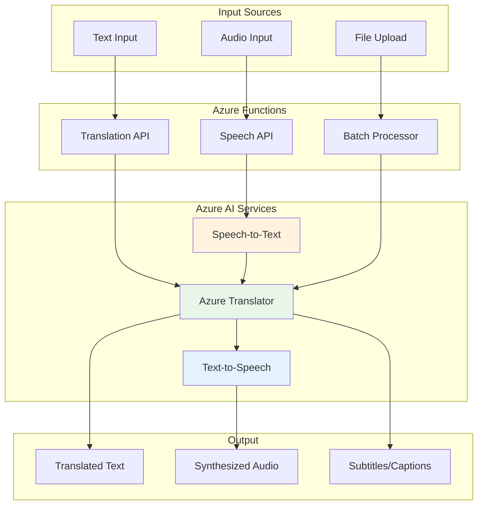

# Project 03: Real-time Translation Service


## 🎯 Project Overview

Build a real-time translation service using Azure Translator and Speech Services that can translate text and speech across multiple languages.

### What You'll Build

- Text translation API supporting 100+ languages
- Speech-to-text transcription
- Text-to-speech synthesis
- Real-time audio translation
- Azure Functions for serverless deployment

### Skills You'll Learn

- Azure Translator API
- Azure Speech Services
- Azure Functions development
- RESTful API design
- Streaming audio processing

---

## 📦 Azure Resources Required

| Resource | SKU/Tier | Purpose |
|----------|----------|---------|
| Azure Translator | S1 | Text translation |
| Azure Speech Services | S0 | Speech-to-text, text-to-speech |
| Azure Functions | Consumption | API hosting |
| Azure Storage | Standard | Function app storage |

### Estimated Monthly Cost

- **Development/Testing**: $10-20/month
- **Production (low volume)**: $30-50/month

---

## 🏗️ Architecture



---

## 📁 Project Structure

```
project-03-translation-service/
├── README.md
├── setup.md
├── architecture.md
├── checklist.md
├── src/
│   ├── __init__.py
│   ├── config.py
│   ├── translator.py
│   ├── speech_service.py
│   ├── function_app.py
│   └── requirements.txt
└── terraform/
    ├── main.tf
    ├── variables.tf
    ├── outputs.tf
    └── terraform.tfvars.example
```

---

## 🚀 Quick Start

### 1. Deploy Infrastructure

```bash
cd terraform
terraform init && terraform apply
```

### 2. Run Locally

```bash
cd ../src
pip install -r requirements.txt
func start
```

### 3. Test Translation

```bash
curl -X POST http://localhost:7071/api/translate \
  -H "Content-Type: application/json" \
  -d '{"text": "Hello world", "from": "en", "to": "es"}'
```

---

## 🔗 Related Resources

- [Azure Translator Documentation](https://learn.microsoft.com/en-us/azure/ai-services/translator/)
- [Azure Speech Service Documentation](https://learn.microsoft.com/en-us/azure/ai-services/speech-service/)
- [Azure Functions Python Developer Guide](https://learn.microsoft.com/en-us/azure/azure-functions/functions-reference-python)

---

*Last updated: November 2025*
