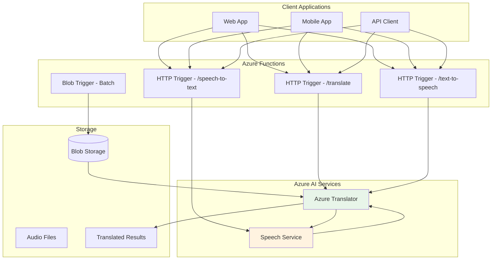
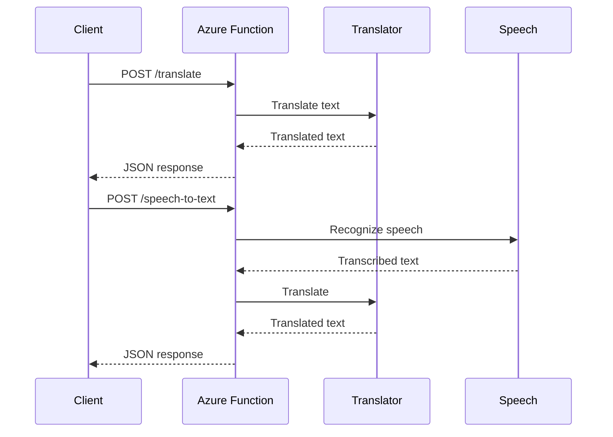

# Project 03: Architecture Guide

## 🏗️ System Architecture

### High-Level Architecture



---

## API Endpoints

### POST /api/translate

Translate text between languages.

```json
// Request
{
  "text": "Hello, how are you?",
  "from": "en",
  "to": ["es", "fr", "de"]
}

// Response
{
  "translations": [
    {"language": "es", "text": "Hola, ¿cómo estás?"},
    {"language": "fr", "text": "Bonjour, comment allez-vous?"},
    {"language": "de", "text": "Hallo, wie geht es Ihnen?"}
  ]
}
```

### POST /api/speech-to-text

Convert audio to text with translation.

### POST /api/text-to-speech

Convert text to spoken audio.

---

## Data Flow



---

## Supported Languages

Azure Translator supports 100+ languages including:

| Category | Languages |
|----------|-----------|
| Major | English, Spanish, French, German, Chinese, Japanese |
| European | Italian, Portuguese, Dutch, Polish, Russian |
| Asian | Korean, Hindi, Thai, Vietnamese, Indonesian |
| Middle Eastern | Arabic, Hebrew, Turkish, Persian |

---

*Next: [Implementation Checklist](./checklist.md)*
