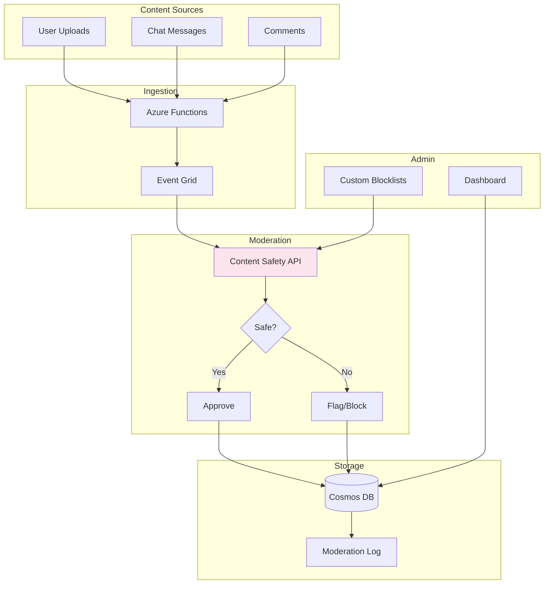

# Project 04: Content Moderation System


## 🎯 Project Overview

Build a content moderation system using Azure AI Content Safety to automatically detect and filter harmful content in text and images.

### What You'll Build

- Text moderation API for user-generated content
- Image moderation for uploads
- Real-time content filtering pipeline
- Custom blocklist management
- Moderation dashboard and reporting

### Skills You'll Learn

- Azure AI Content Safety
- Content moderation best practices
- Event-driven architecture with Event Grid
- Responsible AI implementation

---

## 📦 Azure Resources Required

| Resource | SKU/Tier | Purpose |
|----------|----------|---------|
| Azure AI Content Safety | S0 | Content moderation |
| Azure Functions | Consumption | API and processing |
| Azure Event Grid | Standard | Event routing |
| Azure Blob Storage | Standard | Content storage |
| Azure Cosmos DB | Serverless | Moderation logs |

### Estimated Monthly Cost

- **Development/Testing**: $20-40/month
- **Production (low volume)**: $50-100/month

---

## 🏗️ Architecture



---

## 📁 Project Structure

```
project-04-content-moderation/
├── README.md
├── setup.md
├── architecture.md
├── checklist.md
├── src/
│   ├── __init__.py
│   ├── config.py
│   ├── content_moderator.py
│   ├── blocklist_manager.py
│   ├── function_app.py
│   └── requirements.txt
└── terraform/
    ├── main.tf
    ├── variables.tf
    ├── outputs.tf
    └── terraform.tfvars.example
```

---

## 🚀 Quick Start

### 1. Deploy Infrastructure

```bash
cd terraform
terraform init && terraform apply
```

### 2. Run Locally

```bash
cd ../src
pip install -r requirements.txt
func start
```

### 3. Test Moderation

```bash
curl -X POST http://localhost:7071/api/moderate-text \
  -H "Content-Type: application/json" \
  -d '{"text": "Sample text to moderate"}'
```

---

## 🔗 Related Resources

- [Azure AI Content Safety Documentation](https://learn.microsoft.com/en-us/azure/ai-services/content-safety/)
- [Content Safety Studio](https://contentsafety.cognitive.azure.com/)
- [Responsible AI Principles](https://www.microsoft.com/en-us/ai/responsible-ai)

---

*Last updated: November 2025*
