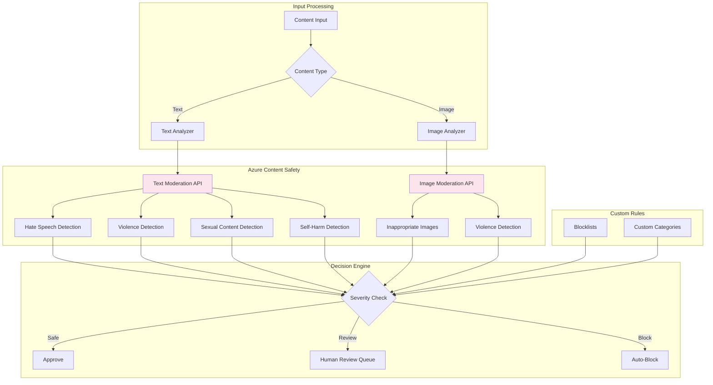
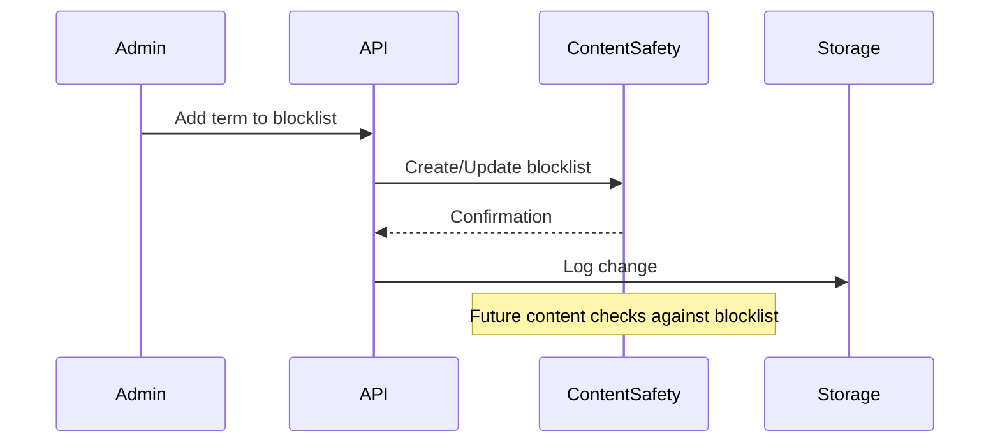

# Project 04: Architecture Guide

## 🏗️ System Architecture

### Content Moderation Flow



---

## Severity Levels

Azure Content Safety returns severity scores (0-7) for each category:

| Level | Score | Action |
|-------|-------|--------|
| Safe | 0-1 | Auto-approve |
| Low | 2-3 | Log only |
| Medium | 4-5 | Flag for review |
| High | 6-7 | Auto-block |

---

## API Response Structure

```json
{
  "categoriesAnalysis": [
    {
      "category": "Hate",
      "severity": 0
    },
    {
      "category": "Violence", 
      "severity": 2
    },
    {
      "category": "Sexual",
      "severity": 0
    },
    {
      "category": "SelfHarm",
      "severity": 0
    }
  ],
  "blocklistsMatch": [],
  "decision": "approve"
}
```

---

## Custom Blocklist Management



---

*Next: [Implementation Checklist](./checklist.md)*
