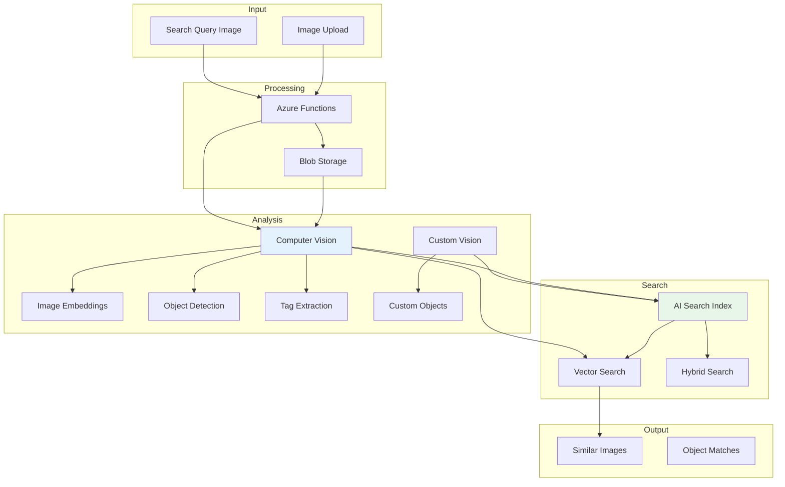

# Project 05: Visual Search Engine


## 🎯 Project Overview

Build a visual search engine that allows users to search for similar images using Azure Computer Vision and AI Search with vector embeddings.

### What You'll Build

- Image upload and analysis pipeline
- Visual feature extraction using Computer Vision
- Vector-based image similarity search
- Custom object detection with Custom Vision
- REST API for visual search queries

### Skills You'll Learn

- Azure Computer Vision image analysis
- Vector embeddings for images
- Azure AI Search with vector search
- Custom Vision model training
- Image processing pipelines

---

## 📦 Azure Resources Required

| Resource | SKU/Tier | Purpose |
|----------|----------|---------|
| Azure Computer Vision | S1 | Image analysis and embeddings |
| Azure AI Search | Basic | Vector search index |
| Azure Custom Vision | S0 | Custom object detection |
| Azure Blob Storage | Standard | Image storage |
| Azure Functions | Consumption | API endpoints |

### Estimated Monthly Cost

- **Development/Testing**: $40-70/month
- **Production (low volume)**: $100-200/month

---

## 🏗️ Architecture



---

## 📁 Project Structure

```
project-05-visual-search/
├── README.md
├── setup.md
├── architecture.md
├── checklist.md
├── src/
│   ├── __init__.py
│   ├── config.py
│   ├── vision_service.py
│   ├── search_service.py
│   ├── blob_handler.py
│   ├── function_app.py
│   └── requirements.txt
└── terraform/
    ├── main.tf
    ├── variables.tf
    ├── outputs.tf
    └── terraform.tfvars.example
```

---

## 🚀 Quick Start

### 1. Deploy Infrastructure

```bash
cd terraform
terraform init && terraform apply
```

### 2. Index Sample Images

```bash
cd ../src
python index_images.py --folder ./sample_images
```

### 3. Search by Image

```bash
curl -X POST http://localhost:7071/api/search \
  -F "image=@query_image.jpg"
```

---

## 🔗 Related Resources

- [Azure Computer Vision Documentation](https://learn.microsoft.com/en-us/azure/ai-services/computer-vision/)
- [Azure AI Search Vector Search](https://learn.microsoft.com/en-us/azure/search/vector-search-overview)
- [Custom Vision Documentation](https://learn.microsoft.com/en-us/azure/ai-services/custom-vision-service/)

---

*Last updated: November 2025*
