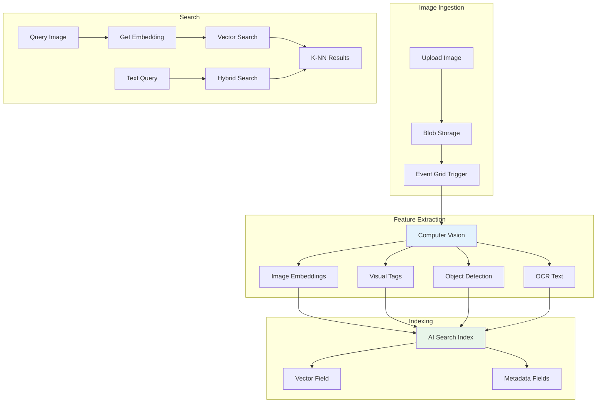
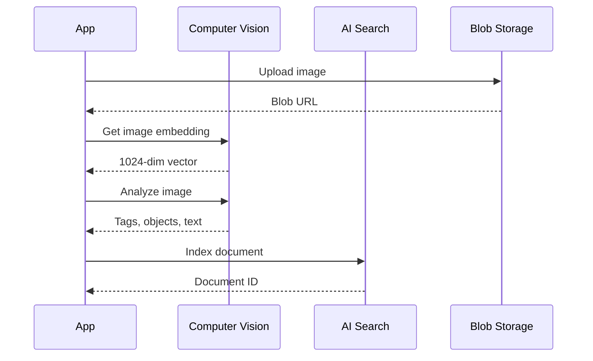

# Project 05: Architecture Guide

## 🏗️ System Architecture

### Visual Search Pipeline



---

## Image Embedding Process



---

## Index Schema

```json
{
  "name": "visual-search-index",
  "fields": [
    {"name": "id", "type": "Edm.String", "key": true},
    {"name": "imageUrl", "type": "Edm.String"},
    {"name": "embedding", "type": "Collection(Edm.Single)", 
     "dimensions": 1024, "vectorSearchProfile": "default"},
    {"name": "tags", "type": "Collection(Edm.String)", "searchable": true},
    {"name": "objects", "type": "Collection(Edm.String)", "searchable": true},
    {"name": "text", "type": "Edm.String", "searchable": true},
    {"name": "uploadedAt", "type": "Edm.DateTimeOffset"}
  ]
}
```

---

## Search Modes

### 1. Pure Vector Search
Find visually similar images using embedding similarity.

### 2. Hybrid Search
Combine vector similarity with keyword matching on tags/objects.

### 3. Tag-based Search
Search by specific tags or detected objects.

---

*Next: [Implementation Checklist](./checklist.md)*
