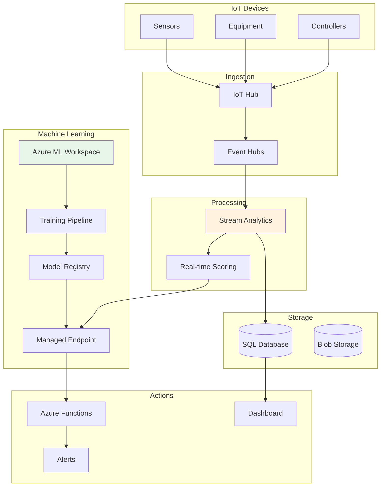

# Project 06: Predictive Maintenance Solution


## 🎯 Project Overview

Build a predictive maintenance solution that uses IoT sensor data and machine learning to predict equipment failures before they occur.

### What You'll Build

- IoT data ingestion pipeline
- Real-time streaming analytics
- ML model for failure prediction
- Alert and notification system
- Maintenance dashboard

### Skills You'll Learn

- Azure Machine Learning
- Azure IoT Hub
- Azure Stream Analytics
- Time series analysis
- MLOps practices

---

## 📦 Azure Resources Required

| Resource | SKU/Tier | Purpose |
|----------|----------|---------|
| Azure Machine Learning | Basic | Model training and deployment |
| Azure IoT Hub | S1 | Device connectivity |
| Azure Stream Analytics | Standard | Real-time processing |
| Azure Event Hubs | Standard | Event streaming |
| Azure SQL Database | Basic | Historical data |
| Azure Functions | Consumption | Alerting logic |

### Estimated Monthly Cost

- **Development/Testing**: $80-150/month
- **Production (low volume)**: $200-400/month

---

## 🏗️ Architecture



---

## 📁 Project Structure

```
project-06-predictive-maintenance/
├── README.md
├── setup.md
├── architecture.md
├── checklist.md
├── src/
│   ├── data_generator/
│   │   └── simulate_sensors.py
│   ├── ml/
│   │   ├── train.py
│   │   ├── score.py
│   │   └── register_model.py
│   ├── streaming/
│   │   └── stream_analytics_query.sql
│   ├── functions/
│   │   └── alert_handler.py
│   └── requirements.txt
└── terraform/
    ├── main.tf
    ├── variables.tf
    ├── outputs.tf
    └── terraform.tfvars.example
```

---

## 🚀 Quick Start

### 1. Deploy Infrastructure

```bash
cd terraform
terraform init && terraform apply
```

### 2. Train the Model

```bash
cd ../src/ml
python train.py --data-path ./sample_data
python register_model.py
```

### 3. Start Simulation

```bash
python data_generator/simulate_sensors.py
```

---

## 🔗 Related Resources

- [Azure Machine Learning Documentation](https://learn.microsoft.com/en-us/azure/machine-learning/)
- [Azure IoT Hub Documentation](https://learn.microsoft.com/en-us/azure/iot-hub/)
- [Azure Stream Analytics](https://learn.microsoft.com/en-us/azure/stream-analytics/)

---

*Last updated: November 2025*
