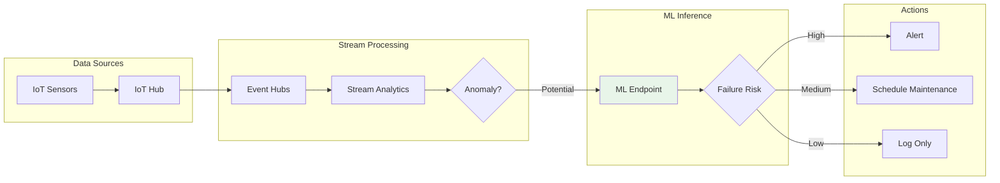
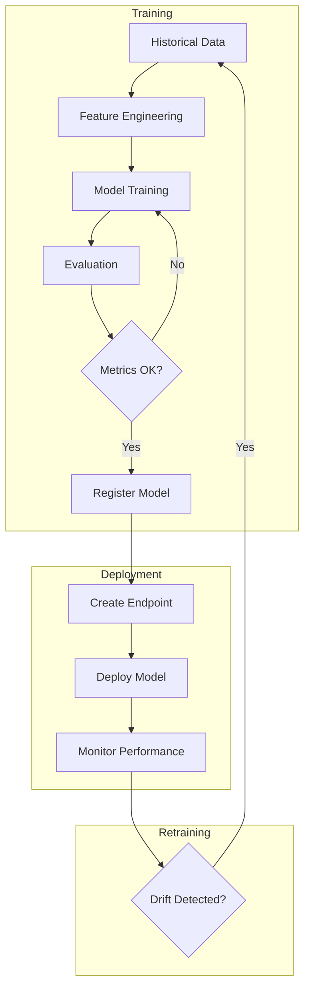

# Project 06: Architecture Guide

## 🏗️ System Architecture

### Data Pipeline



---

## Machine Learning Pipeline



---

## Feature Engineering

Key features for predictive maintenance:

| Feature | Description | Type |
|---------|-------------|------|
| temperature_avg | Rolling average temperature | Numeric |
| vibration_std | Vibration standard deviation | Numeric |
| operating_hours | Total hours in operation | Numeric |
| time_since_maintenance | Days since last maintenance | Numeric |
| failure_history | Previous failure count | Numeric |

---

## Stream Analytics Query

```sql
SELECT
    System.Timestamp() as event_time,
    device_id,
    AVG(temperature) as avg_temp,
    STDEV(vibration) as vibration_std,
    MAX(pressure) as max_pressure
INTO
    [output-eventhub]
FROM
    [input-iothub]
TIMESTAMP BY event_time
GROUP BY
    device_id,
    TumblingWindow(minute, 5)
HAVING
    AVG(temperature) > 80 OR STDEV(vibration) > 0.5
```

---

*Next: [Implementation Checklist](./checklist.md)*
