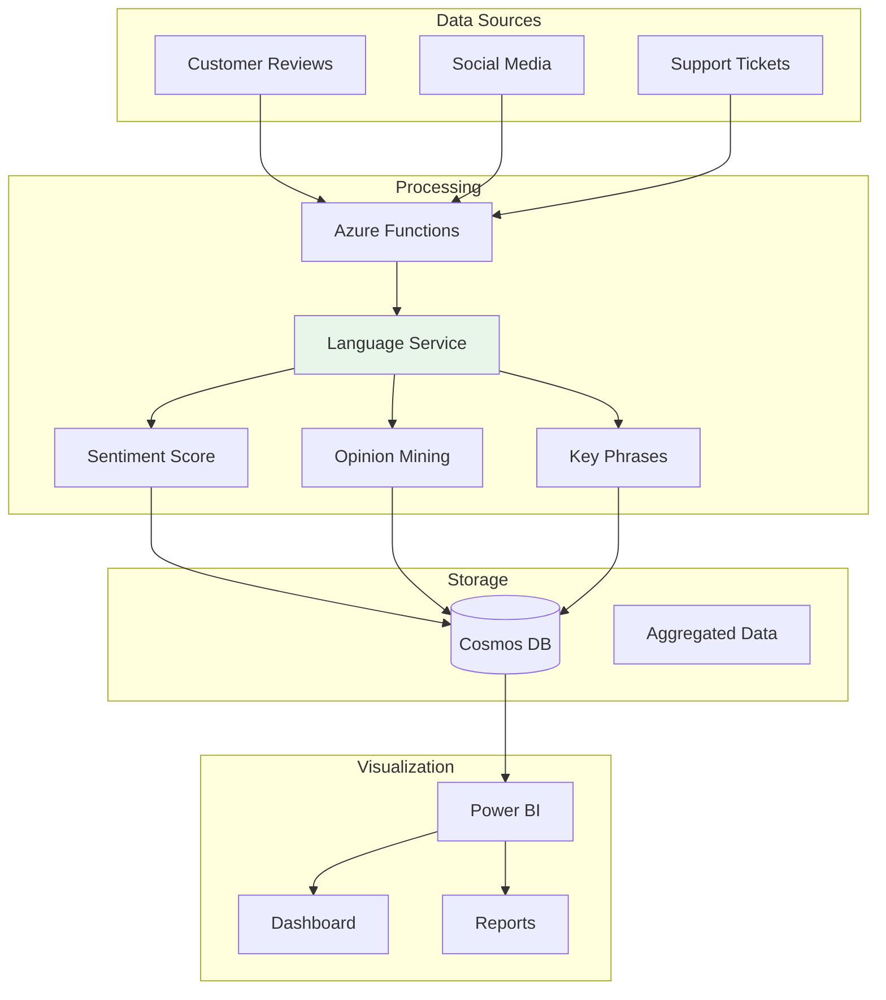

# Project 07: Sentiment Analysis Dashboard


## 🎯 Project Overview

Build a sentiment analysis dashboard that analyzes customer feedback in real-time using Azure AI Language and visualizes insights with Power BI.

### What You'll Build

- Text sentiment analysis API
- Opinion mining for aspect-based sentiment
- Real-time feedback processing
- Analytics dashboard
- Trend analysis and reporting

### Skills You'll Learn

- Azure AI Language Service
- Sentiment analysis APIs
- Opinion mining
- Power BI integration
- Data visualization

---

## 📦 Azure Resources Required

| Resource | SKU/Tier | Purpose |
|----------|----------|---------|
| Azure AI Language | S | Sentiment analysis |
| Azure Functions | Consumption | API endpoints |
| Azure Cosmos DB | Serverless | Data storage |
| Azure Event Hubs | Basic | Real-time streaming |

### Estimated Monthly Cost

- **Development/Testing**: $15-30/month
- **Production (low volume)**: $40-80/month

---

## 🏗️ Architecture



---

## 📁 Project Structure

```
project-07-sentiment-analysis/
├── README.md
├── setup.md
├── architecture.md
├── checklist.md
├── src/
│   ├── __init__.py
│   ├── config.py
│   ├── sentiment_analyzer.py
│   ├── function_app.py
│   └── requirements.txt
└── terraform/
    ├── main.tf
    ├── variables.tf
    ├── outputs.tf
    └── terraform.tfvars.example
```

---

## 🚀 Quick Start

### 1. Deploy Infrastructure

```bash
cd terraform
terraform init && terraform apply
```

### 2. Test Sentiment Analysis

```bash
curl -X POST http://localhost:7071/api/analyze \
  -H "Content-Type: application/json" \
  -d '{"text": "I love this product! It exceeded my expectations."}'
```

---

## 🔗 Related Resources

- [Azure AI Language Documentation](https://learn.microsoft.com/en-us/azure/ai-services/language-service/)
- [Sentiment Analysis API](https://learn.microsoft.com/en-us/azure/ai-services/language-service/sentiment-opinion-mining/)
- [Power BI Documentation](https://learn.microsoft.com/en-us/power-bi/)

---

*Last updated: November 2025*
