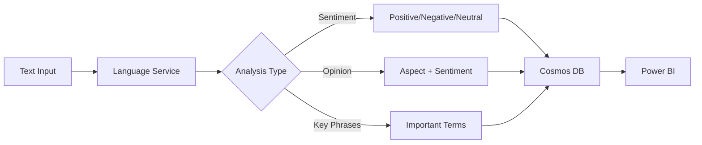
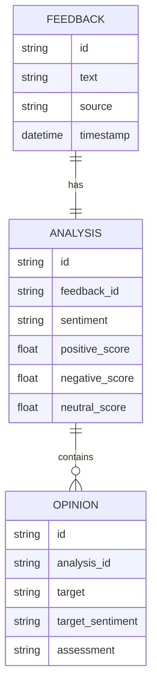

# Project 07: Architecture Guide

## 🏗️ System Architecture

### Sentiment Analysis Pipeline



---

## API Response Structure

### Sentiment Analysis

```json
{
  "documents": [{
    "id": "1",
    "sentiment": "positive",
    "confidenceScores": {
      "positive": 0.95,
      "neutral": 0.03,
      "negative": 0.02
    },
    "sentences": [{
      "sentiment": "positive",
      "text": "I love this product!",
      "confidenceScores": {...}
    }]
  }]
}
```

### Opinion Mining

```json
{
  "documents": [{
    "id": "1",
    "sentences": [{
      "targets": [{
        "text": "battery life",
        "sentiment": "positive",
        "confidenceScores": {...}
      }],
      "assessments": [{
        "text": "excellent",
        "sentiment": "positive"
      }]
    }]
  }]
}
```

---

## Data Model



---

## Dashboard Metrics

| Metric | Description |
|--------|-------------|
| Sentiment Score | Average sentiment over time |
| Volume | Number of feedbacks processed |
| Trend | Sentiment change over periods |
| Topics | Most mentioned aspects |
| Alerts | Negative sentiment spikes |

---

*Next: [Implementation Checklist](./checklist.md)*
