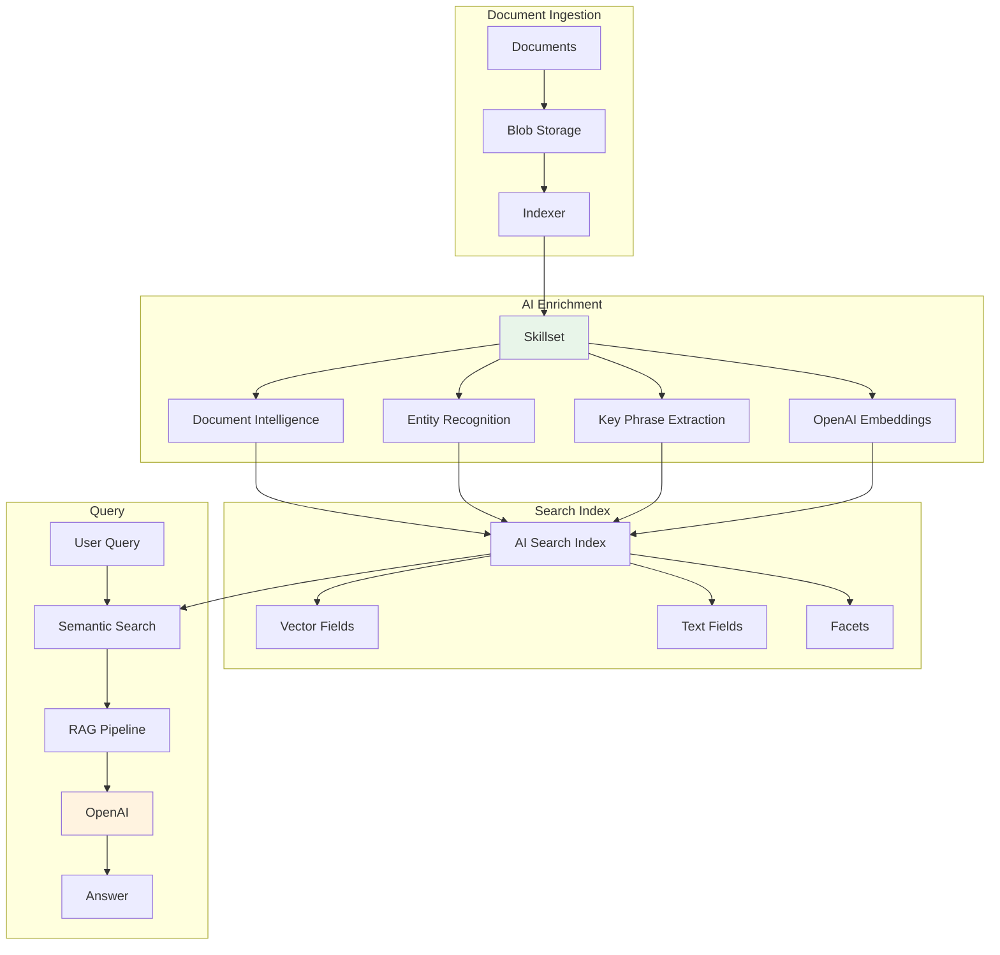

# Project 08: AI Knowledge Mining System


## 🎯 Project Overview

Build an enterprise knowledge mining system that extracts insights from unstructured documents using Azure AI Search, Document Intelligence, and OpenAI.

### What You'll Build

- Document ingestion pipeline
- AI-powered content extraction
- Semantic search with vector embeddings
- Question-answering over documents
- Knowledge graph visualization

### Skills You'll Learn

- Azure AI Search with skillsets
- Azure Document Intelligence
- Azure OpenAI for embeddings and QA
- Knowledge extraction patterns
- RAG (Retrieval Augmented Generation)

---

## 📦 Azure Resources Required

| Resource | SKU/Tier | Purpose |
|----------|----------|---------|
| Azure AI Search | Standard | Search and indexing |
| Azure Document Intelligence | S0 | Document processing |
| Azure OpenAI | S0 | Embeddings and QA |
| Azure Blob Storage | Standard | Document storage |
| Azure Functions | Consumption | Processing pipeline |

### Estimated Monthly Cost

- **Development/Testing**: $100-180/month
- **Production**: $300-500/month

---

## 🏗️ Architecture



---

## 📁 Project Structure

```
project-08-knowledge-mining/
├── README.md
├── setup.md
├── architecture.md
├── checklist.md
├── src/
│   ├── __init__.py
│   ├── config.py
│   ├── ingestion.py
│   ├── search_service.py
│   ├── rag_pipeline.py
│   └── requirements.txt
└── terraform/
    ├── main.tf
    ├── variables.tf
    ├── outputs.tf
    └── terraform.tfvars.example
```

---

## 🚀 Quick Start

### 1. Deploy Infrastructure

```bash
cd terraform && terraform init && terraform apply
```

### 2. Index Documents

```bash
python src/ingestion.py --folder ./documents
```

### 3. Query Knowledge Base

```bash
python src/rag_pipeline.py --query "What are the key policies?"
```

---

## 🔗 Related Resources

- [Azure AI Search Skillsets](https://learn.microsoft.com/en-us/azure/search/cognitive-search-concept-intro)
- [RAG with Azure](https://learn.microsoft.com/en-us/azure/search/retrieval-augmented-generation-overview)

---

*Last updated: November 2025*
