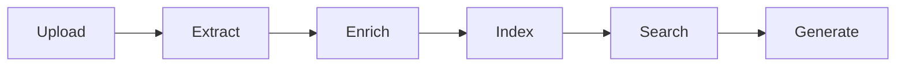

# Project 08: Architecture & Checklist

## Architecture

### Knowledge Mining Pipeline



### Skillset Configuration

```json
{
  "skills": [
    {"@odata.type": "#Microsoft.Skills.Text.EntityRecognitionSkill"},
    {"@odata.type": "#Microsoft.Skills.Text.KeyPhraseExtractionSkill"},
    {"@odata.type": "#Microsoft.Skills.Custom.WebApiSkill"} 
  ]
}
```

---

## Implementation Checklist

### Phase 1: Infrastructure
- [ ] Deploy AI Search (Standard)
- [ ] Deploy Document Intelligence
- [ ] Deploy OpenAI with embeddings model
- [ ] Deploy Blob Storage

### Phase 2: Ingestion
- [ ] Create blob container
- [ ] Configure indexer
- [ ] Set up skillset with AI enrichment
- [ ] Create search index with vector fields

### Phase 3: RAG Pipeline
- [ ] Implement document chunking
- [ ] Generate embeddings
- [ ] Implement semantic search
- [ ] Build QA pipeline with OpenAI

### Phase 4: Testing
- [ ] Upload sample documents
- [ ] Test search queries
- [ ] Validate QA responses
- [ ] Measure latency and accuracy

---

## Completion Criteria

| Requirement | Status |
|-------------|--------|
| Documents indexed | ⬜ |
| Semantic search working | ⬜ |
| RAG pipeline functional | ⬜ |
| QA accurate and grounded | ⬜ |
