# Project 09: Multi-modal AI Assistant


## 🎯 Project Overview

Build a multi-modal AI assistant that can understand and process text, images, and audio using Azure OpenAI GPT-4o and Azure Speech Services.

### What You'll Build

- Multi-modal chat interface
- Image understanding and description
- Voice input/output capabilities
- Tool/function calling for actions
- Conversation memory and context

### Skills You'll Learn

- Azure OpenAI GPT-4o (vision)
- Azure Speech Services
- Multi-modal prompt engineering
- Agent tool calling
- Real-time audio streaming

---

## 📦 Azure Resources Required

| Resource | SKU/Tier | Purpose |
|----------|----------|---------|
| Azure OpenAI | S0 | GPT-4o with vision |
| Azure Speech | S0 | Speech-to-text, text-to-speech |
| Azure Cosmos DB | Serverless | Conversation history |
| Azure Functions | Consumption | API endpoints |

---

## 🏗️ Architecture

```mermaid
graph TB
    subgraph "Input Modalities"
        A[🎤 Voice]
        B[📷 Image]
        C[💬 Text]
    end
    
    subgraph "Processing"
        A --> D[Speech-to-Text]
        D --> E[GPT-4o]
        B --> E
        C --> E
        E --> F{Action?}
        F -->|Yes| G[Tool Execution]
        G --> E
        F -->|No| H[Response]
    end
    
    subgraph "Output"
        H --> I[Text Response]
        H --> J[Text-to-Speech]
    end
    
    style E fill:#e8f5e9
```



---

## 📁 Project Structure

```
project-09-multimodal-assistant/
├── README.md
├── setup.md
├── architecture.md
├── src/
│   ├── assistant.py
│   ├── tools.py
│   ├── speech_handler.py
│   └── requirements.txt
└── terraform/
    ├── main.tf
    └── variables.tf
```

---

## 🚀 Quick Start

```bash
# Deploy
cd terraform && terraform init && terraform apply

# Run assistant
cd ../src && python assistant.py
```

---

## Example: Image Analysis

```python
from assistant import MultiModalAssistant

assistant = MultiModalAssistant()

# Analyze an image
response = assistant.chat(
    message="What's in this image?",
    image_url="https://example.com/image.jpg"
)
print(response)
```

---

*Last updated: November 2025*
