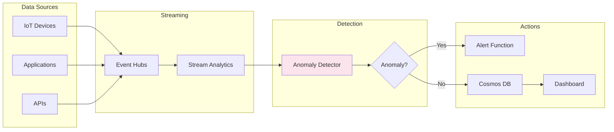

# Project 10: AI-Powered Anomaly Detection


## 🎯 Project Overview

Build a real-time anomaly detection system for time series data using Azure Anomaly Detector and Stream Analytics.

### What You'll Build

- Time series data ingestion
- Real-time anomaly detection
- Alert and notification system
- Historical analysis dashboard
- Customizable sensitivity thresholds

### Skills You'll Learn

- Azure Anomaly Detector API
- Time series analysis
- Azure Stream Analytics
- Event-driven architecture
- Monitoring and alerting

---

## 📦 Azure Resources Required

| Resource | SKU/Tier | Purpose |
|----------|----------|---------|
| Azure Anomaly Detector | S0 | Anomaly detection |
| Azure Event Hubs | Standard | Data streaming |
| Azure Stream Analytics | Standard | Real-time processing |
| Azure Functions | Consumption | Alert handling |
| Azure Cosmos DB | Serverless | Data storage |

---

## 🏗️ Architecture



---

## 📁 Project Structure

```
project-10-anomaly-detection/
├── README.md
├── setup.md
├── architecture.md
├── src/
│   ├── anomaly_detector.py
│   ├── data_simulator.py
│   ├── function_app.py
│   └── requirements.txt
└── terraform/
    ├── main.tf
    └── variables.tf
```

---

## 🚀 Quick Start

```bash
# Deploy infrastructure
cd terraform && terraform init && terraform apply

# Start data simulator
cd ../src && python data_simulator.py

# Monitor for anomalies
python anomaly_detector.py --mode stream
```

---

## Detection Modes

| Mode | Use Case | Latency |
|------|----------|---------|
| Batch | Historical analysis | Minutes |
| Streaming | Real-time detection | Seconds |
| Last Point | Single point check | Milliseconds |

---

## 🔗 Related Resources

- [Azure Anomaly Detector Documentation](https://learn.microsoft.com/en-us/azure/ai-services/anomaly-detector/)
- [Time Series Analysis Best Practices](https://learn.microsoft.com/en-us/azure/ai-services/anomaly-detector/concepts/best-practices)

---

*Last updated: November 2025*
