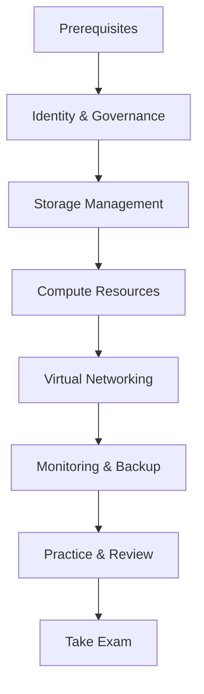

# 🛠️ AZ-104: Microsoft Azure Administrator

## 📋 Overview

The **Azure Administrator Associate** certification validates your ability to implement, manage, and monitor an organization's Microsoft Azure environment. This is a core infrastructure certification essential for Azure professionals.

### 🎯 Who Should Take This Exam?

This certification is ideal for:
- IT administrators managing Azure environments
- System administrators transitioning to cloud
- DevOps engineers working with Azure infrastructure
- Cloud architects (prerequisite for AZ-305)
- IT professionals seeking Azure expertise

### ✅ Prerequisites

**Recommended Knowledge:**
- Operating systems (Windows/Linux)
- Networking fundamentals
- Server and virtualization concepts
- PowerShell or Azure CLI experience
- Azure fundamentals (AZ-900 recommended)

**Technical Skills:**
- Azure portal navigation
- Azure Resource Manager templates
- Basic scripting abilities

## 📊 Skills Measured (As of April 2025)

| Domain | Weight |
|--------|--------|
| Manage Azure identities and governance | 20-25% |
| Implement and manage storage | 15-20% |
| Deploy and manage Azure compute resources | 20-25% |
| Implement and manage virtual networking | 15-20% |
| Monitor and maintain Azure resources | 10-15% |

## 📚 Quick Links

| Resource | Description |
|----------|-------------|
| [📖 Study Guide](./study-guide.md) | Detailed exam objectives and study topics |
| [📚 Learning Modules](./learning-modules.md) | Official Microsoft Learn paths and modules |
| [🧪 Practice Resources](./practice-resources.md) | Practice tests, labs, and exercises |
| [📁 Labs](./labs/) | Lab files and scripts |
| [🔧 Azure Resources Reference](./azure-resources.md) | Explanation of core Azure admin resources (compute, network, storage, identity) |

## 🎯 Exam Details

| Aspect | Details |
|--------|---------|
| **Exam Code** | AZ-104 |
| **Exam Title** | Microsoft Azure Administrator |
| **Duration** | 100 minutes |
| **Questions** | 40-60 questions |
| **Passing Score** | 700/1000 |
| **Cost** | $165 USD |
| **Languages** | Multiple languages available |

## 🛤️ Learning Path

## 📅 Suggested Study Schedule (8 Weeks)

### Weeks 1-2: Identity & Governance
- [ ] Microsoft Entra ID (Azure AD)
- [ ] Users, groups, and licenses
- [ ] Role-based access control (RBAC)
- [ ] Azure Policy and management groups
- [ ] Resource locks and tags

### Weeks 3-4: Storage
- [ ] Storage account configuration
- [ ] Blob, File, Table, Queue storage
- [ ] Storage security (SAS, keys, firewalls)
- [ ] Azure Files and File Sync
- [ ] Data management and tiering

### Weeks 5-6: Compute & Networking
- [ ] Virtual machines deployment
- [ ] VM availability and scaling
- [ ] App Service and containers
- [ ] Virtual networks and subnets
- [ ] Network security groups
- [ ] Load balancing and VPN

### Weeks 7-8: Monitoring & Review
- [ ] Azure Monitor and alerts
- [ ] Log Analytics
- [ ] Azure Backup
- [ ] Practice assessments
- [ ] Final review

## 🔗 Official Resources

- [Official Exam Page](https://learn.microsoft.com/en-us/credentials/certifications/azure-administrator/)
- [Study Guide](https://learn.microsoft.com/en-us/credentials/certifications/resources/study-guides/az-104)
- [Free Practice Assessment](https://learn.microsoft.com/en-us/credentials/certifications/azure-administrator/practice/assessment?assessment-type=practice&assessmentId=21&practice-assessment-type=certification)
- [Exam Sandbox](https://aka.ms/examdemo)

## 📖 Learning Paths

| Path | Description | Duration |
|------|-------------|----------|
| [Prerequisites](https://learn.microsoft.com/en-us/training/paths/az-104-administrator-prerequisites/) | Azure basics for admins | 5 modules |
| [Identity & Governance](https://learn.microsoft.com/en-us/training/paths/az-104-manage-identities-governance/) | Entra ID, RBAC, Policy | 6 modules |
| [Storage](https://learn.microsoft.com/en-us/training/paths/az-104-manage-storage/) | Storage accounts, security | 4 modules |
| [Compute](https://learn.microsoft.com/en-us/training/paths/az-104-manage-compute-resources/) | VMs, containers, App Service | 5 modules |
| [Networking](https://learn.microsoft.com/en-us/training/paths/az-104-manage-virtual-networks/) | VNets, NSGs, load balancing | 6 modules |
| [Monitor & Backup](https://learn.microsoft.com/en-us/training/paths/az-104-monitor-backup-resources/) | Azure Monitor, Backup | 4 modules |

## 🎓 Related Certifications

**Prerequisites for:**
- **AZ-305**: Azure Solutions Architect Expert

**Related Certifications:**
- **AZ-500**: Azure Security Engineer
- **AZ-400**: DevOps Engineer Expert
- **AZ-700**: Network Engineer Associate

---

*Last updated: November 2025*
